# 부동산 토큰 증권(STO) 발행 및 거래 시스템

 

    

## 📌 제안 배경 및 목적

---

### 1. 국내 STO 시장 전망: 미래 먹거리

STO(Security Token Offering, 증권형 토큰 발행)는 디지털 자산 시장의 새로운 패러다임을 이끌 핵심 기술입니다.  
국내에서는 규제 샌드박스 적용을 받은 일부 조각투자 플랫폼을 통해 제한적으로 제공되어 왔습니다.

최근 금융당국이 **토큰 증권의 제도권 편입을 결정**하고, **STO 가이드라인을 발표**하면서 업계의 주목을 받고 있습니다.  
토큰 증권은 다음과 같은 특징을 가지고 있습니다.

- **다양한 실물/무형 자산 투자 가능**
- **조각투자**를 통한 일반 투자자의 진입 장벽 완화
- **투자 생태계 전환을 이끄는 새로운 디지털 자산**

### 2. 부동산 토큰 증권: 부동산 투자의 혁신

부동산 STO 시장은 **자본 시장과 블록체인 기술의 결합**을 통해 새로운 전환점을 맞이하고 있습니다.

#### ✅ 주요 효과

- **다양한 투자자 자금 조달 가능**  
  → 기존 은행·증권사 대출 외 새로운 자금 조달 경로 확보
- **PF 방식 한계 극복**  
  → 투자자는 리스크 분산 효과, 사업자는 대출 이자 절감으로 가격 안정화
- **투자 프로세스 간소화**  
  → 중개인 및 중간 단계를 최소화하고 스마트 계약으로 효율적 투자 가능
- **소액 투자 기회 확대**  
  → 고가의 부동산을 직접 구매하지 않고도 여러 개발 프로젝트에 참여 가능

#### 🚀 기대 효과

- 부동산 개발 STO를 통한 **투자 패러다임 혁신**
- PF전단채 발행이 어려운 현재 시장에서 **개발 단계 리스크 솔루션 제공**
- 부동산을 시작으로 **다양한 실물 자산의 토큰화** 확장

#### 🎯 결론

본 프로젝트는 **블록체인 기반의 부동산 STO 발행 및 거래 시스템 설계**를 목표로 합니다.  
이를 통해 부동산 투자 시장의 혁신과 투자 생태계의 확장을 이끌고자 합니다.

## 📌 제안 내용

---

    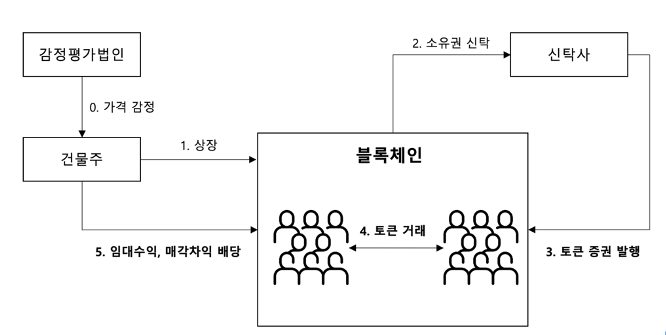

부동산 토큰 증권의 발행 및 거래 과정은 다음과 같습니다.

1. **감정평가**: 공인 감정평가법인이 건물의 가치를 평가
2. **건물 상장**: 감정평가를 기반으로 가격 검증 후 상장
3. **소유권 신탁**: 건물주는 상장된 부동산의 소유권을 신탁사에 신탁
4. **토큰 증권 발행**: 신탁사는 블록체인을 활용하여 토큰 증권 발행
5. **토큰 매매**: 발행된 토큰 증권이 투자자 간 매매됨
6. **배당**: 투자자는 부동산 투자 대가로 임대수익 또는 매각차익을 배당받음

#### 🔗 블록체인 기록

- **토큰 증권 발행**, **토큰 매매**, **배당 과정**은 모두 블록체인에 기록되어  
  거래의 **투명성, 신뢰성, 불변성**을 보장합니다.

#### 🎯 핵심 설계 집중 영역

- **토큰 증권 발행**
- **토큰 증권 거래**
- **투자자 배당 프로세스**

→ 이 세 가지를 중점적으로 시스템을 설계하고자 합니다.

## 📌 시스템 구현

---

### 1. 프로그램 흐름도

프로그램 실행 목록에는 **유저 등록, 토큰 발행, 토큰 거래, 배당 지급**이 있으며,  
이 모든 과정은 블록체인 네트워크에 기록됩니다.

    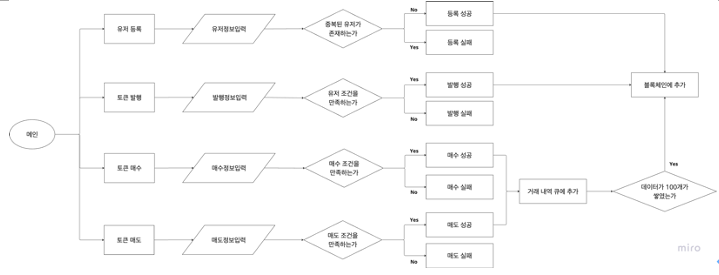

### 2. 자료구조 관계 구조도

본 시스템은 다음과 같이 자료구조를 활용하여 구현되었습니다.

- **유저, 토큰, 배당** → `Map` 자료구조
- **주문 (매수/매도)** → `Heap` 구조
  - 매수: Max Heap
  - 매도: Min Heap
- **체결된 거래** → `Queue` 구조 (10개 단위로 블록체인 기록)

    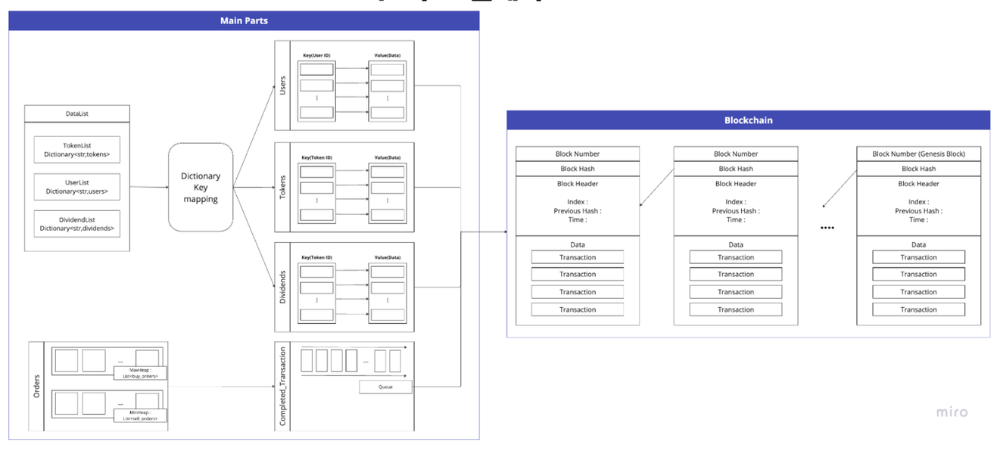

### 3. 핵심 자료구조

#### 3.1 블록체인은 해시로 이어지는 단순 연결 리스트 자료구조

- **구조**: 해시로 연결된 단순 연결 리스트
- **특징**: 동적 크기 조절 가능, 무결성 보장, 변경 불가
- **연산**: `add_block` → O(1)

    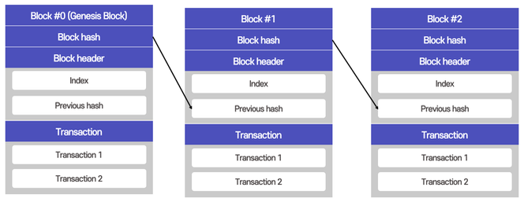

#### 3.2 유저 정보, 토큰 정보, 배당 정보를 저장하는 맵 자료구조

- **선택 이유**: Key 기반 접근(O(1))으로 데이터 관리 용이
- **활용**:
  - 특정 토큰 ID → 토큰 정보 조회
  - 유저 ID → 보유 토큰 확인 및 배당 지급

  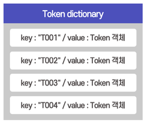
  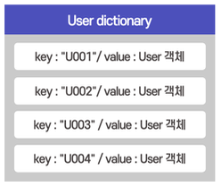
  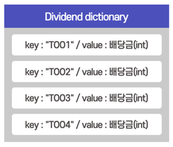

#### 3.3 매도, 매수 주문을 저장하는 힙 자료구조

- **구조**:
  - 매도 주문 → Min Heap
  - 매수 주문 → Max Heap
- **효율성**: O(n log n)으로 정렬 가능
- **활용**: Bid-Ask Spread 계산

  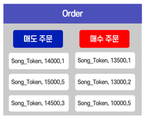
  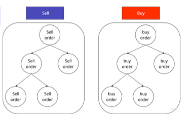

#### 3.4 체결된 거래를 저장하는 큐 자료구조

- **활용 방식**:
  - 거래 체결 → 큐에 순차 저장
  - 거래 10건 누적 → 블록체인에 일괄 기록
- **연산 복잡도**:
  - Enqueue → O(1)
  - Dequeue → O(1)

  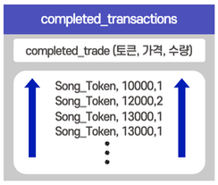
  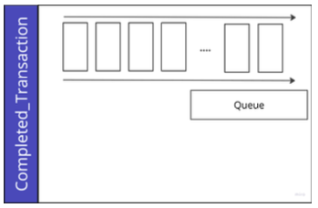

### 4. 클래스 다이어그램

시스템을 구성하는 주요 클래스와 관계는 아래와 같습니다.  
모든 클래스는 블록체인과 유기적으로 연결되어 있으며,  
**Token, User, Order, Exchange, Dividend** 등이 함께 작동합니다.

    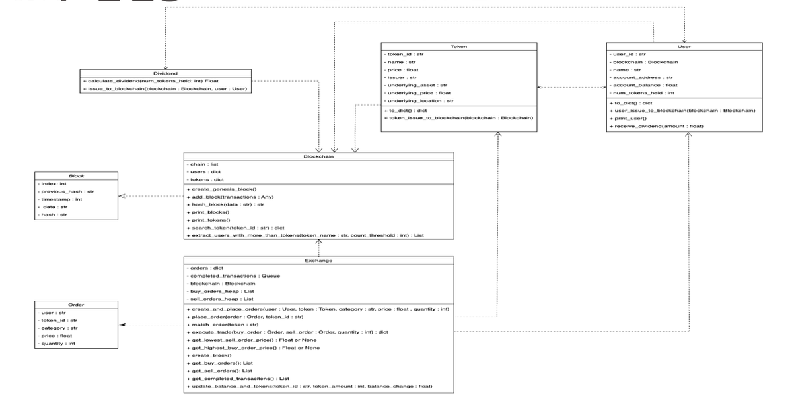

### 5. 기능 명세

#### 5.1 Block 핵심 정보

| 정보          | 설명        |
| ------------- | ----------- |
| index         | 블록 인덱스 |
| previous_hash | 이전 해시값 |
| timestamp     | 타임스탬프  |
| data          | 데이터      |
| hash          | 현재 해시값 |

#### 5.2 Blockchain 기능 명세

| 메서드               | 기능               | 설명                                                                                                                                                            |
| -------------------- | ------------------ | --------------------------------------------------------------------------------------------------------------------------------------------------------------- |
| create_genesis_block | 제네시스 블록 생성 | 제네시스 블록을 생성하고 블록체인에 추가합니다. 블록 인덱스를 0, 이전 해시는 `"0"`, 타임스탬프는 현재 시간, 데이터는 `"Genesis Block"`으로 설정하여 생성합니다. |
| add_block            | 블록 추가          | 새로운 블록을 생성하고 블록체인에 추가합니다. 트랜잭션 데이터를 받아 이전 블록의 해시, 인덱스, 타임스탬프 등을 활용하여 블록을 생성합니다.                      |
| print_blocks         | 블록체인 정보 출력 | 현재 블록체인에 있는 각 블록의 **인덱스, 이전 해시, 타임스탬프, 데이터, 블록 해시**를 출력합니다.                                                               |
| print_tokens         | 토큰 정보 출력     | 블록체인에서 발행된 각 토큰에 대한 정보를 출력합니다.                                                                                                           |
| search_token         | 토큰 검색          | `token_id`를 입력 받아 `tokens` 사전에서 해당 토큰의 관련 정보를 반환합니다.                                                                                    |
| hash_block           | 해시값 변환        | 주어진 데이터를 **SHA-256 해시 함수**를 사용해 해시값으로 변환하여 반환합니다.                                                                                  |

#### 5.3 Token 핵심 정보

| 정보                | 설명          |
| ------------------- | ------------- |
| id                  | 토큰 아이디   |
| name                | 토큰 이름     |
| price               | 토큰 가격     |
| issuer              | 발행자        |
| underlying_asset    | 기초자산명    |
| underlying_price    | 기초자산 가격 |
| underlying_location | 기초자산 위치 |

#### 5.3 Token 기능 명세

| 메서드                    | 기능                       | 설명                                                                                                                                                                                                                                                               |
| ------------------------- | -------------------------- | ------------------------------------------------------------------------------------------------------------------------------------------------------------------------------------------------------------------------------------------------------------------ |
| to_dict                   | 데이터 구조화              | `Token` 객체를 사전(`dict`) 표현으로 변환합니다.                                                                                                                                                                                                                   |
| token_issue_to_blockchain | 토큰 발행 및 블록체인 기록 | `to_dict` 메서드를 사용해 `Token` 객체를 딕셔너리로 변환하고, 키는 `token_id`, 값은 토큰 데이터인 맵 구조를 구성합니다. 이후 `blockchain` 객체의 `add_block` 메서드를 호출하여 토큰 데이터를 매개변수로 전달함으로써 토큰을 발행함과 동시에 블록체인에 기록합니다. |

#### 5.4 User 핵심 정보

| 정보            | 설명           |
| --------------- | -------------- |
| id              | 유저 이름      |
| name            | 유저명         |
| account_address | 유저 계좌 주소 |
| account_balance | 계좌 잔고      |
| num_tokens_held | 보유 토큰 개수 |

#### 5.4 User 기능 명세

| 메서드                   | 기능                       | 설명                                                                                                                                                                                                                                                         |
| ------------------------ | -------------------------- | ------------------------------------------------------------------------------------------------------------------------------------------------------------------------------------------------------------------------------------------------------------ |
| to_dict                  | 데이터 구조화              | `User` 객체를 사전(`dict`) 표현으로 변환합니다.                                                                                                                                                                                                              |
| user_issue_to_blockchain | 유저 등록 및 블록체인 기록 | `to_dict` 메서드를 사용해 `User` 객체를 딕셔너리로 변환하고, 키는 `user_id`, 값은 유저 데이터인 맵 구조를 구성합니다. 이후 `blockchain` 객체의 `add_block` 메서드를 호출하여 유저 데이터를 매개변수로 전달함으로써 유저 등록과 동시에 블록체인에 기록합니다. |
| print_user               | 유저 정보 확인             | 사용자 ID, 이름, 계정 주소, 계정 잔액, 보유 토큰 수 등 사용자 정보를 출력합니다.                                                                                                                                                                             |
| receive_dividend         | 배당 지급                  | `amount` 매개변수를 사용하여 지정된 배당금만큼 사용자의 계정 잔액을 증가시키고, 새 계정 잔액과 함께 배당금 수령 메시지를 출력합니다.                                                                                                                         |

#### 5.5 Order 핵심 정보

| 정보     | 설명                     |
| -------- | ------------------------ |
| user     | 주문자명                 |
| token_id | 토큰 ID                  |
| category | 매수 또는 매도 종류 선택 |
| price    | 주문 가격                |
| quantity | 주문 수량                |

#### 5.6 Exchange 핵심 정보

| 정보                   | 설명                                                          |
| ---------------------- | ------------------------------------------------------------- |
| orders                 | 토큰 별 주문 저장 딕셔너리 (토큰 ID 기준 매수/매도 주문 분류) |
| blockchain             | 거래 데이터를 기록하는 블록체인 객체                          |
| completed_transactions | 완료된 트랜잭션을 저장하는 대기열                             |
| buy_orders_heap        | 매수 주문의 최대 힙 (Max Heap)                                |
| sell_orders_heap       | 매도 주문의 최소 힙 (Min Heap)                                |

#### 5.6 Exchange 기능 명세

| 메서드                      | 기능      | 설명                                                                                                                                                         |
| --------------------------- | --------- | ------------------------------------------------------------------------------------------------------------------------------------------------------------ |
| create_and_place_orders     | 주문 처리 | `Order` 객체를 생성하고 `place_order` 메서드를 사용하여 배치하는 편리한 메서드입니다.                                                                        |
| place_order                 | 주문 실행 | `order`와 `token_id`를 매개변수로 사용합니다. 주문을 매칭하기 위해 적절한 힙(매수/매도)에 푸시하고, 이후 `match_orders` 메서드를 호출하여 매칭을 시도합니다. |
| match_orders                | 주문 매칭 | 최고 매수 주문 가격과 최저 매도 주문 가격을 비교하여 매칭합니다. 일치 시 `execute_trade` 메서드를 호출하여 거래를 실행합니다.                                |
| execute_trade               | 거래 처리 | 사용자 토큰 수량 및 계정 잔액을 업데이트하여 거래를 완료합니다. 완료된 거래 정보를 담은 딕셔너리를 반환합니다.                                               |
| get_lowest_sell_order_price | 가격 반환 | 최저 매도 주문 가격을 반환합니다.                                                                                                                            |
| get_highest_buy_order_price | 가격 반환 | 최고 매수 주문 가격을 반환합니다.                                                                                                                            |
| create_block                | 블록 생성 | 최대 10개의 완료된 거래를 포함하는 블록을 생성하여 블록체인에 기록합니다.                                                                                    |
| get_buy_orders              | 주문 반환 | 매수 주문 목록을 반환합니다.                                                                                                                                 |
| get_sell_orders             | 주문 반환 | 매도 주문 목록을 반환합니다.                                                                                                                                 |
| get_completed_transactions  | 주문 반환 | 완료된 거래 목록을 반환합니다.                                                                                                                               |
| update_balance_and_tokens   | 업데이트  | 사용자의 계정 잔액과 토큰 수량을 업데이트합니다.                                                                                                             |

#### 5.7 Dividend 기능 명세

| 메서드              | 기능          | 설명                                                                                                                                                                                                                                                                                                                                                                                                                                                                                                                                      |
| ------------------- | ------------- | ----------------------------------------------------------------------------------------------------------------------------------------------------------------------------------------------------------------------------------------------------------------------------------------------------------------------------------------------------------------------------------------------------------------------------------------------------------------------------------------------------------------------------------------- |
| calculate_dividend  | 배당금 계산   | `num_tokens_held`를 매개변수로 받아 사용자가 보유한 각 토큰에 대한 배당금을 계산합니다. `token_price_map`에서 각 토큰의 가격을 조회하고, 보유 수량과 곱하여 총 배당금을 산출합니다. 계산된 총 배당금을 반환합니다.                                                                                                                                                                                                                                                                                                                        |
| issue_to_blockchain | 블록체인 기록 | `blockchain`과 `user`를 매개변수로 받아 사용자에게 배당금을 발급합니다.  • `calculate_dividend` 메서드로 배당금을 계산하고 `transactions` 딕셔너리에 저장합니다.  • `blockchain.add_block(transactions)`를 호출해 블록체인에 배당금 거래 정보를 기록합니다.  • 배당금을 계산해 `dividend_amount`에 저장하고, 이를 사용자의 계좌에 전송합니다.  • `user.receive_dividend(dividend_amount)`를 호출해 사용자의 계좌를 갱신합니다.  • `user.issue_to_blockchain(blockchain)`을 호출해 사용자 정보를 블록체인에 업데이트합니다. |

## 📌 실행 예시

---

#### 4.1 제네시스 블록 생성, 토큰 발행 및 유저 등록

블록체인을 생성하기 위해서는 초기에 생성하는 제니시스 블록이 있습니다. 먼저 이를 생성한
후에 토큰을 발행합니다. 토큰을 발행할 때는 토큰 ID, 토큰 이름, 토큰 가격, 발행자명, 기초자산명,
기초자산 가격, 기초자산 위치 데이터를 함께 입력합니다. 토큰 ID가 key로 나머지 데이터가
value로 들어가게 됩니다. 예컨대, T001 ID를 가지고 일신관을 기초자산으로 하는 쏭토큰을
발행했고, T002를 가지고 다산관을 기초자산으로 하는 히지토큰을 발행했습니다. 다음으로 유저
등록입니다. 블록체인 네트워크에 참여해 토큰 매매를 하기 위해서 유저 등록을 진행합니다.

    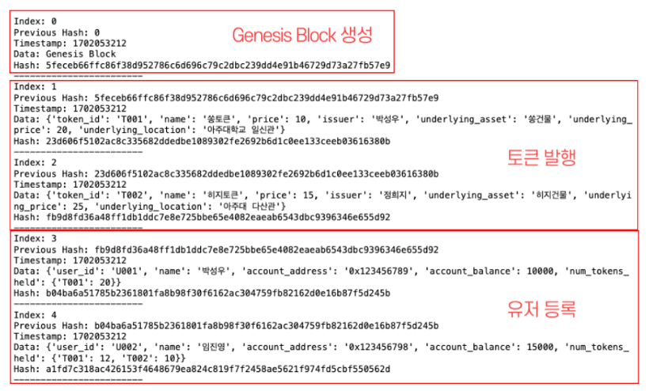

#### 4.2 토큰 매매

토큰을 거래하는 부분입니다. 등록된 유저는 매수인지, 매도인지 입력하고, 특정 토큰을 몇개를
구매할 것이며 이를 얼마에 구매할 지 입력합니다. 이렇게 체결된 거래가 10개가 쌓이면
블록체인에 거래 내역을 기록합니다.

    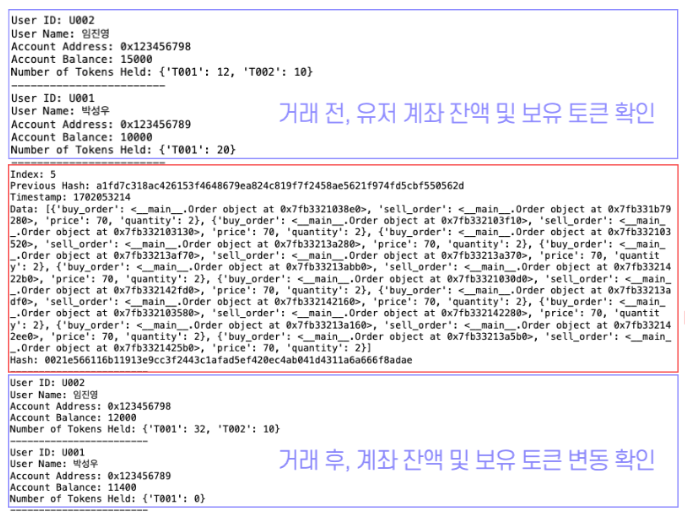

#### 4.3 배당 지급

토큰별 배당금을 할당한 후에 유저가 해당 토큰을 보유하고 있으면 배당금 \* 토큰 개수의 금액을
유저의 잔고에 전송합니다.

    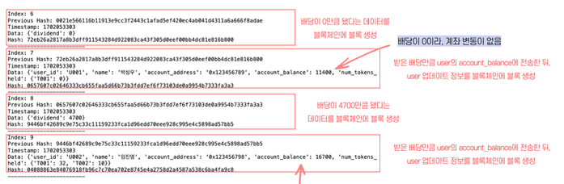

